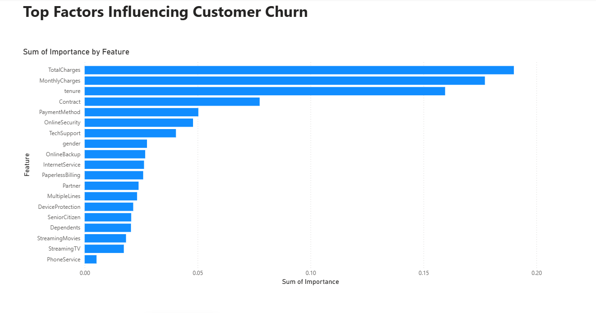

# Customer Churn Prediction & Business Intelligence Platform

**PostgreSQL | SQL | Python | Machine Learning | Random Forest | Power BI | Customer Analytics | Predictive Modeling**

---


---

## Screenshots




## Project Overview

This project is an end-to-end Customer Churn Prediction and Business Intelligence solution designed to identify customers at risk of leaving a telecom company and provide actionable business insights.

The project combines SQL, Python, Machine Learning, and Power BI to analyze customer behavior, predict churn probability, and visualize business insights through interactive dashboards.

---

## Business Problem

Customer churn directly impacts company revenue and growth. Retaining existing customers is often more cost-effective than acquiring new ones.

The objective of this project is to:

* Analyze customer churn patterns
* Identify key churn drivers
* Predict future churn customers
* Provide business recommendations to improve customer retention

---

## Dataset

Dataset: IBM Telco Customer Churn Dataset

Records: 7,043 Customers

Features: 21 Columns

Key Features:

* Customer ID
* Contract Type
* Payment Method
* Internet Service
* Monthly Charges
* Total Charges
* Tenure
* Churn Status

---

## Technology Stack

### Database

* PostgreSQL
* SQL

### Data Analysis

* Python
* Pandas
* NumPy

### Visualization

* Matplotlib
* Seaborn
* Power BI

### Machine Learning

* Scikit-Learn
* Random Forest Classifier

### Version Control

* Git
* GitHub

---

## Project Architecture

Dataset
↓
SQL Analysis
↓
Python EDA
↓
Feature Engineering
↓
Machine Learning Model
↓
Churn Prediction
↓
Power BI Dashboard
↓
Business Recommendations

---

## Exploratory Data Analysis (EDA)

### Key Findings

* Total Customers: 7,043
* Churn Rate: 26.54%
* Retention Rate: 73.46%
* Average Tenure (Retained Customers): 37.57 Months
* Average Tenure (Churned Customers): 17.98 Months
* Average Monthly Charges (Retained Customers): $61.27
* Average Monthly Charges (Churned Customers): $74.44

### Insights

* Customers with lower tenure are more likely to churn.
* Customers paying higher monthly charges show higher churn rates.
* Month-to-month contracts experience significantly higher churn.
* Contract type strongly influences customer retention.

---

## SQL Analysis

Example analyses performed:

* Total Customers
* Churned Customers
* Churn Rate Percentage
* Contract Type Analysis
* Payment Method Analysis
* Revenue Analysis

SQL scripts are available in the `sql/` directory.

---

## Machine Learning Model

Model Used:

* Random Forest Classifier

### Model Performance

| Metric            | Score |
| ----------------- | ----- |
| Accuracy          | 80%   |
| ROC-AUC           | 0.84  |
| Precision (Churn) | 0.66  |
| Recall (Churn)    | 0.48  |
| F1 Score          | 0.56  |

### Top Predictive Features

1. TotalCharges
2. MonthlyCharges
3. Tenure
4. Contract
5. PaymentMethod

---

## Power BI Dashboard

### Executive Overview


---

### Customer Analytics


---

### Prediction Center


---

### Feature Importance


---

## Project Structure

```text
customer-churn-prediction-bi-platform/

├── data/
│   ├── raw/
│   └── processed/
│
├── sql/
│   ├── schema.sql
│   ├── import_data.sql
│   └── analysis_queries.sql
│
├── scripts/
│   ├── churn_analysis.py
│   ├── train_model.py
│   └── predict_churn.py
│
├── models/
│   └── random_forest.pkl
│
├── dashboard/
│   └── Customer_Churn_Dashboard.pbix
│
├── screenshots/
│   ├── executive_overview.png
│   ├── customer_analytics.png
│   ├── prediction_center.png
│   └── feature_importance.png
│
├── reports/
│   └── Customer_Churn_Presentation.pptx
│
└── README.md
```

---

## Business Recommendations

* Focus retention campaigns on month-to-month contract customers.
* Introduce incentives for new customers during their first year.
* Offer loyalty discounts to reduce churn among high-risk customers.
* Monitor customers with high monthly charges and low tenure.
* Use churn probability scores for proactive customer retention efforts.

---

## Expected Business Benefits

* Reduced customer churn
* Increased customer lifetime value
* Improved customer retention strategy
* Better decision-making through data-driven insights
* Early identification of high-risk customers

